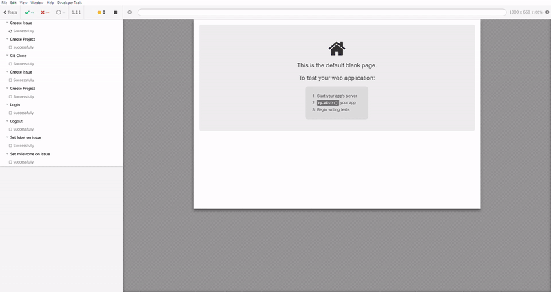

# Curso Cypress Intermediário

Projeto do curso de Cypress nível intermediário da escola Talking About Testing online school.

    

## Pré-requisitos

Antes de começar, garanta que os seguintes sistemas estejam instalados em seu computador.

- [git](https://git-scm.com/) (estou usando a versão `2.31.1` enquanto desenvolvo os testes)
- [Node.js](https://nodejs.org/en/) (estou usando a versão `v16.13.2` enquanto desenvolvo os testes)
- npm (estou usando a versão `8.3.2` enquanto desenvolvo os testes)
- [Google Chrome](https://www.google.com/intl/pt_br/chrome/) (estou usando a versão `102.0.5005.63 (Official Build) (x86_64)` enquanto desenvolvo os testes)
- [Visual Studio Code](https://code.visualstudio.com/) (estou usando a versão `1.67.2` enquanto desenvolvo os testes) ou alguma outra IDE de sua preferência
- [Docker Desktop](https://docs.docker.com/desktop/) (estou usando a versão `4.4.4` enquanto desenvolvo os testes)

> **Obs.:** Recomendo utilizar as mesmas versões, ou versões mais recentes dos sistemas listados acima.
>
> **Obs. 2:** Ao instalar o Node.js o npm é instalado junto. 🎉
>
> **Obs. 3:** Para verificar as versões do git, Node.js e npm instaladas em seu computador, execute o comando `git --version && node --version && npm --version` no seu terminal de linha de comando.
>
> **Obs. 4:** Deixei links para os instaladores na lista de requisitos acima, caso não os tenha instalados ainda.
>
> **Obs. 5:** Caso tenha alguma dúvida [aqui](https://gitlab.com/wlsf82/curso-cypress-intermediario) está o repositório do Walmyr que desenvolveu o curso.
___

Legal, os pre-requisitos estão prontos. ☑️

## Instalação

No terminal execute `npm install` (ou `npm i`) para realizar a instalação da dev dependencies.

Execute o comando docker run --publish 80:80 --publish 22:22 --hostname localhost wlsf82/gitlab-ce e aguarde até o ambiente inicializar (isso pode levar alguns minutos).

## Testes

Você pode executar os testes simulando uma versão _Desktop_ do GitLab.

### Desktop

- No terminal execute `npm run cy:open` para abrir o _Test Runner_ e rodar os testes ou escolher um cenário específico.

  Ou

- No terminal execute `npm run cy:run` executar os teste no modo _headless_ e executar todos os testes

## Apoiar esse projeto

Se você gostar desse projeto deixa uma ⭐.

___

Este projeto foi desenvolvido por [Pet 🐱](https://www.linkedin.com/in/petherson-erasmo/) enquanto assista o curso de cypress intemediário do [Walmyr](https://talkingabouttesting.coursify.me/courses/testes-automatizados-com-cypress-intermediario).